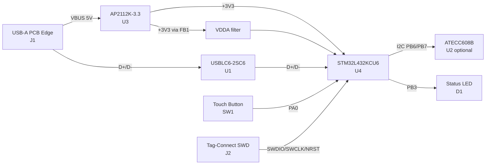

# 2FA Key — Open-Source Hardware Security Key

A from-scratch, open-source **FIDO2 / U2F USB security key** built around the
**STM32L432KCU6** — the same MCU used by the SoloKeys Solo 1 — so mature, audited
FIDO2/CTAP firmware runs with little or no modification.

> **Status:** 🔧 *Hardware in development.* Schematic complete and ERC-clean.
> PCB layout is being redone after an MCU-footprint change and re-annotation.
> This repository currently covers the **hardware only** (schematic, PCB, BOM).
> Firmware is out of scope here — see [Firmware](#firmware) for pointers.

---

## Table of Contents

- [Features](#features)
- [Design Goals](#design-goals)
- [Specifications](#specifications)
- [Block Diagram](#block-diagram)
- [Bill of Materials](#bill-of-materials)
- [Where to Buy](#where-to-buy)
- [MCU Pin Assignment](#mcu-pin-assignment)
- [Power Architecture](#power-architecture)
- [PCB / Fabrication Notes](#pcb--fabrication-notes)
- [Layout Guidelines](#layout-guidelines)
- [Programming & Flashing](#programming--flashing)
- [Firmware](#firmware)
- [Security Notes](#security-notes)
- [Repository Layout](#repository-layout)
- [Building the Hardware](#building-the-hardware)
- [References](#references)
- [License](#license)

---

## Features

- 🔐 **FIDO2 / U2F** hardware authenticator (WebAuthn / CTAP2)
- 🧠 **STM32L432KCU6** Cortex-M4, 80 MHz, 256 KB flash, hardware **TRNG**
- 🔌 **USB-A PCB-edge "blade"** — the board edge *is* the plug (no connector cost)
- 🧭 **Crystal-less USB** — internal HSI48 + Clock Recovery System (CRS), no external crystal
- 👆 **User-presence button** ("touch to confirm") required for each operation
- 💡 **Status LED**
- 🛡️ **USB ESD protection** (USBLC6-2SC6) inline on the data pair
- 🔑 **Optional ATECC608B** secure element on I²C for hardware key isolation
- 🪛 **Tag-Connect SWD** programming footprint (no header to solder)
- 🗝️ **Flash readout protection (RDP Level 2)** for keys-at-rest security

## Design Goals

Priority order:

1. **Run proven firmware.** The STM32L432KC is the Solo 1 / maintained Nitrokey
   FIDO2 MCU, so existing open-source firmware runs directly.
2. **Real key protection.** Private keys live in internal flash protected by
   **RDP2** (set only when firmware is final — effectively irreversible). An
   **optional ATECC608B** is available for hardware key isolation if firmware
   is written to use it.
3. **Buildable.** Single MCU, no crystal, cheap USB-A edge blade, 2-layer board.

## Specifications

| Item | Value |
|------|-------|
| MCU | STM32L432KCU6 (UFQFPN-32, 5×5 mm) |
| Core | Arm Cortex-M4F @ 80 MHz |
| Flash / RAM | 256 KB / 64 KB |
| USB | 2.0 Full-Speed (12 Mbps), crystal-less (HSI48 + CRS) |
| Connector | USB-A, PCB-edge blade |
| Secure element | ATECC608B (optional, I²C) |
| Regulator | AP2112K-3.3 LDO (5 V → 3.3 V, 600 mA) |
| Programming | SWD via Tag-Connect TC2030-NL |
| PCB | 2-layer FR4, ground pour both sides |
| EDA tool | KiCad 10 |

## Block Diagram



## Bill of Materials

Reference designators match the current schematic (post re-annotation).
Footprints are the **actual** sizes on the board.

| Ref | Qty | Value | Package | Function |
|-----|-----|-------|---------|----------|
| **U4** | 1 | STM32L432KCU6 | UFQFPN-32 | Main MCU (USB FS, TRNG, 256 KB flash) |
| **U1** | 1 | USBLC6-2SC6 | SOT-23-6 | USB D±/VBUS ESD protection |
| **U2** | 1 | ATECC608B-SSHDA-B | SOIC-8 | *Optional* secure element (ECC P-256) |
| **U3** | 1 | AP2112K-3.3 | SOT-23-5 | 5 V → 3.3 V LDO regulator |
| **J1** | 1 | USB-A PCB edge | board edge | USB host interface (no part) |
| **J2** | 1 | TC2030-NL | footprintless | SWD programming/debug (no part) |
| **SW1** | 1 | Tactile switch | XKB TS-1187A | User-presence button |
| **D1** | 1 | LED | 0805 | Status indicator |
| **FB1** | 1 | 600 Ω @ 100 MHz | 0805 | VDDA analog-supply ferrite |
| **R1** | 1 | 330 Ω | 0805 | LED current limit |
| **R2** | 1 | 10 kΩ | 0805 | BOOT0 pull-down |
| **R3** | 1 | 10 kΩ | 0805 | Button pull-up |
| **R4** | 1 | 4.7 kΩ | 0805 | I²C SDA pull-up |
| **R5** | 1 | 4.7 kΩ | 0805 | I²C SCL pull-up |
| **C1** | 1 | 4.7 µF | 0603 | VBUS input bulk |
| **C2** | 1 | 1 µF | 0603 | +3V3 bulk |
| **C3** | 1 | 100 nF | 0603 | MCU VDD (pin 1) decoupling |
| **C4** | 1 | 100 nF | 0603 | MCU VDD (pin 17) decoupling |
| **C5** | 1 | 100 nF | 0603 | VDDA HF decoupling |
| **C6** | 1 | 100 nF | 0603 | NRST filter |
| **C7** | 1 | 1 µF | 0603 | VDDA bulk decoupling |
| **C8** | 1 | 100 nF | 0603 | ATECC VCC decoupling |

> **Note:** U2 (ATECC608B) is only required if the firmware is written to use it.
> Stock Solo firmware relies on internal flash + RDP2 and does **not** use it.

## Where to Buy

Representative Mouser parts (passives are generic — any reputable equivalent works):

| Item | MPN | Link |
|------|-----|------|
| MCU | STM32L432KCU6 | [Mouser](https://www.mouser.com/ProductDetail/STMicroelectronics/STM32L432KCU6) |
| LDO | AP2112K-3.3TRG1 | [Mouser](https://www.mouser.com/ProductDetail/Diodes-Incorporated/AP2112K-3.3TRG1) |
| Secure element | ATECC608B-SSHDA-B | [Mouser](https://www.mouser.com/ProductDetail/Microchip-Technology/ATECC608B-SSHDA-B) |
| USB ESD | USBLC6-2SC6 | [Mouser](https://www.mouser.com/ProductDetail/STMicroelectronics/USBLC6-2SC6) |
| Ferrite (0805, 600 Ω) | BLM21PG600SN1D | [Mouser](https://www.mouser.com/ProductDetail/Murata-Electronics/BLM21PG600SN1D) |
| LED (0805, green) | APTD2012LZGCK | [Mouser](https://www.mouser.com/c/?q=APTD2012LZGCK) |
| Resistors (0805, 1%) | Yageo RC0805 series | [Mouser](https://www.mouser.com/c/?q=RC0805FR) |
| Capacitors (0603) | Samsung CL10 series | [Mouser](https://www.mouser.com/c/?q=CL10B104KB8NNNC) |

**Tools (not soldered to the board):**

- **Programmer:** any ST-Link (e.g. STLINK-V3MINIE)
- **SWD cable:** Tag-Connect [TC2030-CTX-NL-STDC14](https://www.tag-connect.com/product/tc2030-ctx-nl-stdc14-for-use-with-stm32-processors-with-stlink-v3)
  (bridges the ST-Link's STDC14 header to the board's TC2030 pads)

## MCU Pin Assignment

| STM32 Pin | Signal | Net | Connects to |
|-----------|--------|-----|-------------|
| 21 (PA11) | USB_DM | USB_DN | J1.2 → U1 → PA11 |
| 22 (PA12) | USB_DP | USB_DP | J1.3 → U1 → PA12 |
| 23 (PA13) | SWDIO | SWDIO | J2.2 |
| 24 (PA14) | SWCLK | SWCLK | J2.4 |
| 4 (NRST) | Reset | NRST | J2.3 + C6 |
| 6 (PA0) | Button | BTN | SW1 + R3 pull-up |
| 26 (PB3) | LED drive | — | R1 → D1 |
| 29 (PB6) | I²C SCL | I2C_SCL | U2.6 + R5 |
| 30 (PB7) | I²C SDA | I2C_SDA | U2.5 + R4 |
| 31 (PH3) | BOOT0 | BOOT0 | R2 pull-down |
| 1, 17 (VDD) | +3.3 V | +3V3 | C3, C4 |
| 5 (VDDA) | Analog supply | VDDA | FB1, C5, C7 |
| 16, 32, 33 (VSS/EP) | Ground | GND | incl. exposed pad |

## Power Architecture

```
USB VBUS (5V) ──┬── C1 (4.7µF)
                ├── U1 VBUS (ESD clamp)
                └── U3 AP2112K  VIN + EN ──► VOUT ── +3V3 ──┬── U4 VDD ×2 (C3, C4)
                                                            ├── U2 VCC (C8)
                                                            ├── J2 VCC
                                                            ├── R3/R4/R5 pull-ups
                                                            ├── C2 (1µF bulk)
                                                            └── FB1 ──► VDDA ── U4 VDDA (C5, C7)
```

- **EN tied to VIN** → LDO always on when USB is plugged.
- **VDDA is a separate net** downstream of ferrite **FB1** — do not short it to +3V3.

## PCB / Fabrication Notes

- **Layers:** 2 (F.Cu / B.Cu), ground pour on both, stitched with vias.
- **Board thickness:** target **≈ 2.0 mm** so the USB-A blade mates reliably in
  a standard port. *(Avoid thicker stackups — they may not insert.)*
- **Surface finish:** **ENIG (gold)** — required for the USB gold-finger contacts;
  add a **45° gold-finger bevel** on the insertion edge.
- **Exposed pad:** U4's center pad (pad 33) is tied to GND and needs a **via array**
  into the ground pour.
- **USB routing:** D+/D− as a matched **≈ 90 Ω differential pair**, short, no stubs,
  with U1 (ESD) placed inline right at the connector.
- Run **DRC to zero** before generating fab outputs.

## Layout Guidelines

**Must be close (short, direct traces):**

- Decoupling caps at the pins they serve: **C3 → VDD1, C4 → VDD17, C5/C7 → VDDA,
  C6 → NRST, C8 → ATECC VCC.**
- ESD chain **inline**: `J1 → U1 (USBLC6) → U4` in that physical order.
- LDO caps: **C1 at VIN, C2 at VOUT** (AP2112 needs its output cap nearby).
- **VDDA group** (FB1 + C5 + C7) packed at the VDDA pin, or the filter is defeated.
- Via array under the QFN exposed pad.

**Mechanical / UX:**

- **SW1** on the top face, toward the end *opposite* the USB blade (pressable while plugged in).
- **D1** visible on the top face near an edge.
- **J2 (Tag-Connect):** honor its keepout — no copper/vias under the spring-pad area,
  keep tall parts clear, leave room to press the cable.

## Programming & Flashing

The board is flashed over **SWD** using the Tag-Connect footprint (J2):

1. Connect your ST-Link (e.g. STLINK-V3MINIE) to the board with the
   **TC2030-CTX-NL-STDC14** cable (STDC14 → TC2030 no-legs).
2. Power the board via its USB blade (VBUS → LDO → 3V3).
3. Flash with **STM32CubeProgrammer** (GUI or `STM32_Programmer_CLI`).

**USB DFU (bootloader) is *not* a first-class path on this board:** the built-in
USB bootloader needs **BOOT0 (PH3) high**, but R2 hard-pulls it low with no
button/jumper. Add a way to pull PH3 high before layout if you want ST-Link-free
USB flashing.

> ⚠️ **RDP Level 2 is a one-way door.** Setting RDP2 (the at-rest key protection)
> **permanently disables both SWD and the USB bootloader.** Do all flashing,
> testing, and option-byte work *before* locking it.

## Firmware

Firmware is **not** part of this hardware repo. Recommended targets (Solo 1 lineage,
internal-flash + RDP2 key protection):

- [SoloKeys Solo 1](https://github.com/solokeys/solo)
- [Nitrokey FIDO2 firmware (maintained fork)](https://github.com/Nitrokey/nitrokey-fido2-firmware)

Ensure firmware enables **HSI48 + CRS** for crystal-less USB clocking (Solo firmware
already does).

## Security Notes

- Private keys are stored in **internal flash protected by RDP Level 2**, which is
  effectively irreversible and disables the debug interface.
- The optional **ATECC608B** provides tamper-resistant key storage if the firmware
  is written to use it.
- **RDP2 must be set only after firmware is final** — see the warning above.

## Repository Layout

```
2FA Key/
├── 2FA Key.kicad_pro        # KiCad project
├── 2FA Key.kicad_sch        # Schematic
├── 2FA Key.kicad_pcb        # PCB layout
├── 2FA Key.net              # Netlist
├── DRC.rpt                  # Design Rule Check report
├── demoshape.stl            # Enclosure / mechanical reference
├── 2FA_Key_HANDOFF.md       # Detailed design handoff notes
└── README.md                # This file
```

## Building the Hardware

1. Open `2FA Key.kicad_pro` in **KiCad 10**.
2. Review the schematic and run **ERC** (should be clean).
3. Finish/redo the **PCB layout** per the [layout guidelines](#layout-guidelines).
4. Run **DRC to zero**.
5. Export Gerbers + drill; order with **2.0 mm thickness, ENIG, gold-finger bevel**.
6. Order parts from the [BOM](#bill-of-materials); assemble.
7. Flash firmware over [SWD](#programming--flashing).

## References

- [STM32L432KC datasheet](https://www.st.com/resource/en/datasheet/stm32l432kc.pdf)
- [SoloKeys Solo 1 hardware](https://github.com/solokeys/solo)
- [Nitrokey FIDO2 firmware](https://github.com/Nitrokey/nitrokey-fido2-firmware)
- [U2F Zero (simplest reference)](https://github.com/conorpp/u2f-zero)
- [Tag-Connect cable selection for ST-Link V3](https://www.tag-connect.com/debugger-cable-selection-installation-instructions/stlink-v3)

## License

No license has been specified yet. Consider a permissive open-hardware license
such as **CERN-OHL-P** or **MIT** before publishing.

---

*Hardware designed in KiCad 10. Rev V1A.*
