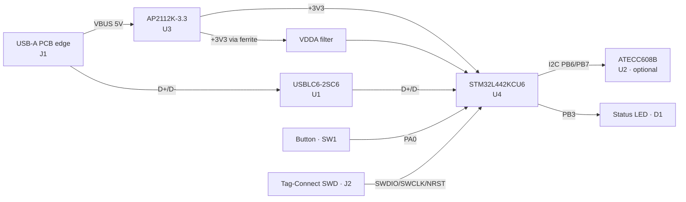

# 2FAK — Open‑Source USB Security Key & STM32L4 Dev Platform

by [Papathought](https://instagram.com/papathought)   [muru.global](https://muru.global) 

A from‑scratch, open‑source **FIDO2 / U2F hardware security key** in a cable‑free
USB‑A form factor — plus **EVIL 2FAK**, the same board sold unlocked as an
**STM32L4 educational/development platform** with example USB‑HID firmware.

One piece of hardware, two personalities:

| | **2FAK** (product) | **EVIL 2FAK** (dev board) |
|---|---|---|
| Role | FIDO2/U2F security key | Reprogrammable STM32L4 USB board |
| Firmware | Open‑source FIDO2 (Solo 1 / Nitrokey lineage) | Your own — ships with a USB‑HID demo |
| Audience | Anyone using 2FA / passkeys | Engineers, makers, security researchers |
| Locked? | RDP after provisioning | Unlocked (RDP 0), fully reflashable |
| Docs | [Product description](2FAK%20-%202-Factor%20Authentication%20Key%20-%20Product%20description.md) | [Product description](EVIL%202FAK%20-%20USB%20Educational%20Development%20Board%20-%20Product%20description.md) |

> **Status:** Hardware complete & bring‑up verified. Both firmwares build, flash, and
> run on the board. See per‑component notes below.

---

## Table of contents
- [Hardware](#hardware)
  - [Block diagram](#block-diagram)
  - [Specifications](#specifications)
  - [Pinout](#pinout)
- [Firmware A — 2FAK security key (FIDO2/U2F)](#firmware-a--2fak-security-key-fido2u2f)
- [Firmware B — EVIL 2FAK USB business card (HID keyboard)](#firmware-b--evil-2fak-usb-business-card-hid-keyboard)
- [Programming & flashing](#programming--flashing)
- [Repository layout](#repository-layout)
- [Security notes](#security-notes)
- [License](#license)

---

## Hardware

A single‑piece 2‑layer PCB whose edge *is* the USB‑A plug (U2F‑Zero / Solo "blade"
style — no connector, no cable). Built around the **STM32L442KCU6** (Cortex‑M4F, USB
FS, TRNG, AES‑256), crystal‑less USB, an optional ATECC608B secure element, a
user‑presence button, a status LED, and a footprint‑less Tag‑Connect SWD port.

### Block diagram



### Specifications

| | |
|---|---|
| MCU | STM32L442KCU6 — Arm Cortex‑M4F @ 80 MHz, UFQFPN‑32 |
| Memory | 256 KB flash · 64 KB SRAM |
| Security | TRNG · AES‑256 · flash readout protection (RDP) · optional ATECC608B |
| USB | 2.0 Full‑Speed, USB‑A PCB‑edge plug, crystal‑less (HSI48 + CRS) |
| Regulator / ESD | AP2112K‑3.3 LDO · USBLC6‑2SC6 TVS on D+/D−/VBUS |
| I/O | Tactile button (PA0) · LED (PB3) |
| Debug | SWD via Tag‑Connect TC2030‑NL (J2) |
| Board | 2‑layer FR4, ground pour both sides, ~48 × 21 mm |
| EDA | KiCad 10 (schematic + PCB in this repo) |

Full bill of materials with Mouser links: see [`firmware/BOARD_2FAKEY.md`](firmware/BOARD_2FAKEY.md)
and the hardware notes / handoff in this folder.

### Pinout

| Signal | Pin | | Signal | Pin |
|--------|-----|---|--------|-----|
| USB D− / D+ | PA11 / PA12 | | I²C SCL / SDA | PB6 / PB7 |
| SWDIO / SWCLK | PA13 / PA14 | | Button | PA0 |
| NRST | NRST | | LED | PB3 |
| BOOT0 | PH3 | | VDD / VDDA | 1,17 / 5 |

Free GPIO for custom firmware (EVIL 2FAK): `PA1–PA10, PA15, PB0, PB1, PB4, PB5, PC14, PC15`.

---

## Firmware A — 2FAK security key (FIDO2/U2F)

A port of the maintained **[Nitrokey FIDO2 firmware](https://github.com/Nitrokey/nitrokey-fido2-firmware)**
(a fork of SoloKeys Solo 1) to this board. The STM32L442 is register‑compatible with
the L432 the firmware targets, so only a small board bring‑up is needed:

- **Button → PA0** (`HWREV=2`), **LED → PB3** (single GPIO), crystal‑less clock as‑is.
- Enumerates as a standard **FIDO2/WebAuthn + U2F** authenticator (USB HID, product
  string `2FAK`). Works driver‑free on Windows/macOS/Linux, and registers with Google,
  personal Microsoft accounts, GitHub, etc.
- Bootloader + application image; supports USB firmware updates after the first flash.

Build & flash details, the attestation‑key/auth‑word gotchas, and prebuilt images:
**[`firmware/BOARD_2FAKEY.md`](firmware/BOARD_2FAKEY.md)** · prebuilt `firmware/prebuilt/all.hex`.

```bash
# flash the complete security-key image over SWD
STM32_Programmer_CLI -c port=SWD -e all -d firmware/prebuilt/all.hex -v -rst
```

> A source‑built key uses **self‑attestation** (AAGUID `c39efba6‑…‑a0ff`). Great for
> personal use; corporate tenants that enforce attestation allow‑lists may reject it.

---

## Firmware B — EVIL 2FAK USB business card (HID keyboard)

A **standalone USB‑HID keyboard** demo (no bootloader; runs at flash base). On a
**button press** it "types" the sequence to open a URL in the default browser and
blinks the LED — a clean, consent‑based demonstration of USB HID output. Enumerates as
`2FAK Business Card`.

- Reuses the same STM32Cube USB core + HAL PCD + crystal‑less clock as Firmware A.
- Self‑contained under [`EVIL 2FAK/`](EVIL%202FAK/); ~9 KB flash.
- Host target: Windows (US layout). Cross‑layout/OS options (Alt+numpad, mass‑storage)
  are discussed in that folder's README.

```bash
# from the EVIL 2FAK/ folder
./build.sh                                              # -> prebuilt/2fak_card.hex
STM32_Programmer_CLI -c port=SWD -e all -d prebuilt/2fak_card.hex -v -rst
# restore the real security key afterwards:
STM32_Programmer_CLI -c port=SWD -e all -d ../firmware/prebuilt/all.hex -v -rst
```

> Educational/dev use only — run HID payloads on machines you own or are authorised to
> test.

---

## Programming & flashing

Both firmwares flash over **SWD** through the **Tag‑Connect TC2030‑NL** pads (J2):

1. Connect an **ST‑Link (V2/V3)** to J2 — for STLINK‑V3 use a
   **[TC2030‑CTX‑NL‑STDC14](https://www.tag-connect.com/product/tc2030-ctx-nl-stdc14-for-use-with-stm32-processors-with-stlink-v3)** cable.
2. Power the board via its USB blade.
3. Flash with **STM32CubeProgrammer** (`STM32_Programmer_CLI`) or debug from
   **STM32CubeIDE** (import as a Makefile project; the build uses the bundled
   `arm-none-eabi-gcc` + `make`).

⚠️ **RDP Level 2** (the 2FAK at‑rest protection) permanently disables SWD *and* the
bootloader — set it only when a product firmware is final. Keep RDP 0 during
development.

---

## Repository layout

```
2FA Key/
├── 2FA Key.kicad_pro / .kicad_sch / .kicad_pcb   # hardware (KiCad 10)
├── 2FA Key.net                                    # netlist
├── 2FAK - ... - Product description.md            # consumer product doc
├── EVIL 2FAK - ... - Product description.md        # dev-board product doc
├── firmware/                                       # Firmware A: FIDO2/U2F security key
│   ├── BOARD_2FAKEY.md                             #   board port + build/flash guide
│   ├── build.sh                                    #   one-command build (Windows/Git Bash)
│   └── prebuilt/                                   #   all.hex, solo.hex, bootloader.hex, ...
├── EVIL 2FAK/                                      # Firmware B: USB HID business card
│   ├── main.c, usbd_kbd.c, usbd_desc.c, usbd_conf.c
│   ├── build.sh, linker.ld, Makefile, README.md
│   └── prebuilt/                                   #   2fak_card.hex
└── README.md                                       # this file
```

## Security notes

- Private keys live in the MCU's protected flash and are never exported; the 2FAK
  firmware can be locked with **RDP** after provisioning.
- The optional **ATECC608B** adds tamper‑resistant key storage if firmware is written
  to use it (stock firmware uses internal flash + RDP).
- EVIL 2FAK ships unlocked by design — treat it as a development board, not a hardened
  product.

## License

No license is set yet. For open hardware + firmware, consider **CERN‑OHL‑P** (hardware)
and the upstream firmware's **Apache‑2.0 / MIT** terms (firmware). Add `LICENSE` files
before publishing.

---

## References
- [STM32L442KC datasheet](https://www.st.com/en/microcontrollers-microprocessors/stm32l442kc.html)
- [SoloKeys Solo 1](https://github.com/solokeys/solo1) · [Nitrokey FIDO2 firmware](https://github.com/Nitrokey/nitrokey-fido2-firmware)
- [Tag‑Connect cable selection (ST‑Link)](https://www.tag-connect.com/debugger-cable-selection-installation-instructions/stlink-v3)
