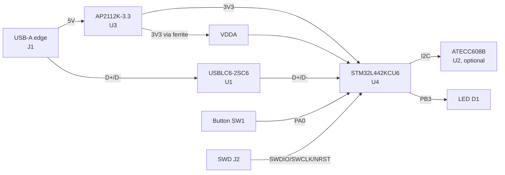

# 2FAK - 2-Factor Authentication Key / STM32 USB Development Board

Open-source USB security key and STM32L4 dev board.
By [muru.global](https://muru.global). Hardware rev V1A. Made in KiCad 10.

It is one board with two uses:

- **2FAK**: a FIDO2 / U2F hardware security key for everyday logins.
- **EVIL 2FAK**: the same board, sold unlocked, as an STM32L4 board you can reprogram.

| | 2FAK | EVIL 2FAK |
|---|---|---|
| Use | Security key | Reprogrammable USB board |
| Firmware | Open-source FIDO2 (Solo 1 / Nitrokey) | Your own. Ships with a USB HID demo |
| For | Anyone using 2FA or passkeys | Makers, engineers, security folks |
| Locked | Yes, after setup (RDP) | No. RDP 0, reflash as much as you want |
| Docs | [Product description](2FAK%20-%202-Factor%20Authentication%20Key%20-%20Product%20description.md) | [Product description](EVIL%202FAK%20-%20USB%20Educational%20Development%20Board%20-%20Product%20description.md) |

Status: hardware is done and tested. Both firmwares build, flash, and run.

## Contents
- [Hardware](#hardware)
- [Firmware A: 2FAK security key](#firmware-a-2fak-security-key)
- [Firmware B: EVIL 2FAK USB business card](#firmware-b-evil-2fak-usb-business-card)
- [How to flash](#how-to-flash)
- [Repo layout](#repo-layout)
- [Security notes](#security-notes)
- [License](#license)

## Hardware

The board edge is the USB-A plug. There is no cable and no connector to break, the same
idea as U2F-Zero and Solo. It runs on an STM32L442KCU6 (Cortex-M4F with USB, a true
random number generator, and AES). USB works without a crystal. There is a button, an
LED, an optional ATECC608B secure element, and a Tag-Connect SWD pad for programming.



### Specs

| Part | Value |
|---|---|
| MCU | STM32L442KCU6, Cortex-M4F, 80 MHz, UFQFPN-32 |
| Memory | 256 KB flash, 64 KB RAM |
| Security | TRNG, AES-256, flash read protection (RDP), optional ATECC608B |
| USB | 2.0 Full-Speed, USB-A edge plug, no crystal (HSI48 + CRS) |
| Power / ESD | AP2112K-3.3 LDO, USBLC6-2SC6 on the USB lines |
| I/O | Button on PA0, LED on PB3 |
| Debug | SWD on a Tag-Connect TC2030-NL pad (J2) |
| Board | 2 layers, ground pour both sides, about 48 x 21 mm |

Bill of materials with Mouser links is in [`firmware/BOARD_2FAKEY.md`](firmware/BOARD_2FAKEY.md).

### Pins

| Signal | Pin | | Signal | Pin |
|---|---|---|---|---|
| USB D- / D+ | PA11 / PA12 | | I2C SCL / SDA | PB6 / PB7 |
| SWDIO / SWCLK | PA13 / PA14 | | Button | PA0 |
| NRST | NRST | | LED | PB3 |
| BOOT0 | PH3 | | VDD / VDDA | 1,17 / 5 |

Free pins for your own firmware: `PA1-PA10, PA15, PB0, PB1, PB4, PB5, PC14, PC15`.

## Firmware A: 2FAK security key

This is the [Nitrokey FIDO2 firmware](https://github.com/Nitrokey/nitrokey-fido2-firmware)
(a fork of SoloKeys Solo 1) ported to this board. The STM32L442 matches the L432 that
the firmware targets, so the changes are small:

- Button set to PA0. LED set to PB3. USB clock left as is.
- The key shows up as a normal FIDO2 and U2F device over USB. No drivers needed on
  Windows, macOS, or Linux. It registers with Google, personal Microsoft accounts,
  GitHub, and other sites that support security keys.
- It has a bootloader plus an app, so you can update it over USB after the first flash.

Build steps, flashing, and prebuilt files are in
[`firmware/BOARD_2FAKEY.md`](firmware/BOARD_2FAKEY.md). Prebuilt image:
`firmware/prebuilt/all.hex`.

```bash
STM32_Programmer_CLI -c port=SWD -e all -d firmware/prebuilt/all.hex -v -rst
```

A key you build yourself uses self-attestation (AAGUID `c39efba6-...-a0ff`). This is
fine for personal accounts. Some company setups only accept certain certified models,
so check with IT before you rely on it at work.

## Firmware B: EVIL 2FAK USB business card

A standalone USB keyboard demo. It has no bootloader and runs straight from the start of
flash. Press the button and it types a link to open it in the browser, and blinks the
LED while it does. It shows up as `2FAK Business Card`.

- Uses the same USB stack and clock as Firmware A.
- Lives in [`EVIL 2FAK/`](EVIL%202FAK/). About 9 KB of flash.
- Built for Windows with a US keyboard layout. Notes on other layouts and other
  operating systems are in that folder's README.

```bash
# from the EVIL 2FAK/ folder
./build.sh
STM32_Programmer_CLI -c port=SWD -e all -d prebuilt/2fak_card.hex -v -rst
# put the real security key back afterwards:
STM32_Programmer_CLI -c port=SWD -e all -d ../firmware/prebuilt/all.hex -v -rst
```

Use HID demos only on machines you own or are allowed to test.

## How to flash

Both firmwares flash over SWD through the Tag-Connect pad (J2):

1. Hold an ST-Link (V2 or V3) on J2. For an STLINK-V3, use a
   [TC2030-CTX-NL-STDC14](https://www.tag-connect.com/product/tc2030-ctx-nl-stdc14-for-use-with-stm32-processors-with-stlink-v3) cable.
2. Power the board from its USB plug.
3. Flash with STM32CubeProgrammer, or debug from STM32CubeIDE. The build uses the
   `arm-none-eabi-gcc` and `make` that ship with STM32CubeIDE.

Warning: RDP Level 2 turns off SWD and the bootloader for good. Only set it once a
product firmware is final. Keep RDP 0 while you develop.

## Security notes

- Private keys stay in the MCU flash and are never read out. The 2FAK firmware can be
  locked with RDP after setup.
- The optional ATECC608B adds tamper-resistant key storage if the firmware uses it. The
  stock firmware uses internal flash and RDP instead.
- EVIL 2FAK ships unlocked on purpose. Treat it as a dev board, not a hardened product.

## Links
- [STM32L442KC datasheet](https://www.st.com/en/microcontrollers-microprocessors/stm32l442kc.html)
- [SoloKeys Solo 1](https://github.com/solokeys/solo1), [Nitrokey FIDO2 firmware](https://github.com/Nitrokey/nitrokey-fido2-firmware)
