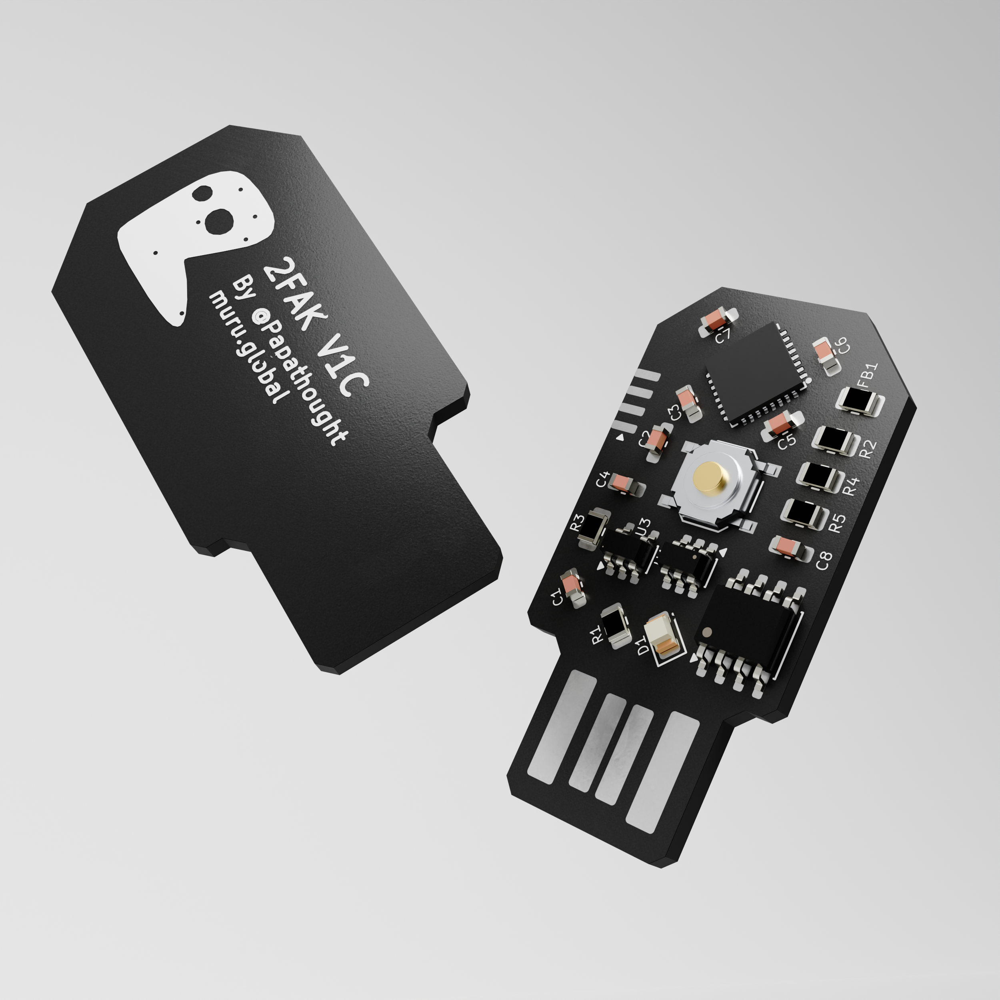
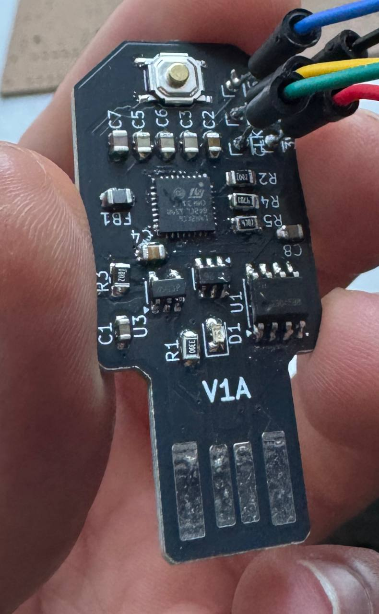

<div align="center">

# 2FAK

**Open-source USB-A security key — FIDO2 / WebAuthn, passkeys, and an optional on-board secure element.**

_by muru.global_

[](LICENSE-APACHE)




<sub>2FAK V1C — the board <em>is</em> the USB-A plug: no cable, no moving connector.</sub>

</div>

---

2FAK is a small, affordable, fully open-source hardware security key. Plug it into any USB-A
port, tap the button, and you are signed in — the private keys are generated and kept on the
device and never leave it, so a fake login page or a stolen laptop gets nothing. It is built
on an STMicroelectronics **STM32L442KCU6** with an optional **ATECC608B** secure element.

- **USB VID/PID:** `0x1209 / 0x2FA2` (0x1209 is the pid.codes open-source Vendor ID; PID 0x2FA2 is registered to us)
- **AAGUID:** `c2aa81f8-352d-56e2-c689-2bfdb5a52ccc`
- **Firmware lineage:** fork of Nitrokey FIDO2 / SoloKeys solo1 (see `NOTICE`)

## Highlights

- 🔐 **Phishing-resistant** FIDO2 / WebAuthn — your login is bound to the real site.
- 🗝️ **Passkeys** — go fully passwordless on the Resident firmware (up to ~50 discoverable credentials).
- 🧩 **The board is the plug** — USB-A male blade, no cable, nothing to wear out.
- 🛡️ **Optional secure element** (ATECC608B) holds a device root that can't be read out.
- ✍️ **Signed USB firmware updates** + irreversible **RDP-2** debug lockdown on production units.
- 💻 **Doubles as a hardware SSH key** — see [Hardware SSH Keys](#hardware-ssh-keys).
- 📖 **Open source** (Apache-2.0) and **open hardware** — inspect everything.

<div align="center">

<br><sub>Assembled 2FAK (V1A).</sub>
</div>

## Firmware editions

One board, two shipping firmware editions built from a single codebase:

| | **2FAK Secure** (Non-Resident) | **2FAK Passkey** (Resident) |
|---|---|---|
| Model | Second factor (server-side credentials) | Passkeys (discoverable credentials) |
| Discoverable credentials (rk) | No | Yes |
| Credential Management | No | Yes |
| ClientPIN protocols | 1 | 1 and 2 |
| Extensions | hmac-secret, credProtect | hmac-secret, credProtect, minPinLength |
| Conformance (self-test) | CTAP2.0, CTAP2.1 | CTAP2.0, CTAP2.1, CTAP2.3 |
| Hardware SSH keys | `ecdsa-sk` (non-resident) | `ecdsa-sk` incl. **resident/portable** |

Conformance is validated against the **FIDO Alliance Conformance Test Tools (self-test)** and
recorded per firmware under `Firmware/.../tests/`. Formal FIDO Certification is a separate
submission and is **not** claimed.

## Hardware

<div align="center">
<table>
<tr>
<td align="center"><br><sub>Schematic (V1C)</sub></td>
<td align="center"><br><sub>PCB layout — X-ray view (V1C)</sub></td>
</tr>
</table>
</div>

### At a glance

| | |
|---|---|
| **MCU** | STM32L442KCU6 — Arm Cortex-M4F, 80 MHz, UFQFPN-32; 256 KB flash / 64 KB SRAM |
| **Secure element** | Microchip ATECC608B on I2C1 (populated variant) |
| **Interface** | USB 2.0 Full-Speed, USB-A male blade (no cable) |
| **Protocols** | FIDO2 / WebAuthn, CTAP2.0 / 2.1 / 2.3 |
| **USB ID** | 0x1209 / 0x2FA2 (pid.codes) |
| **Controls** | Tactile touch button + status LED |
| **Power** | USB bus-powered, ~30 mA, no battery |
| **Size** | ~48 × 21 mm |

<details>
<summary><strong>Full hardware details & pinout</strong></summary>

#### Microcontroller

- **Part:** STM32L442KCU6 (Arm Cortex-M4F, up to 80 MHz, UFQFPN-32). Register-compatible
  with the STM32L432.
- **Memory:** 256 KB flash, 64 KB SRAM.
- **On-chip security:** true random number generator (TRNG), AES-256 hardware accelerator,
  and flash read-out protection (RDP) supported in silicon.
- **Clocking:** crystal-less USB using the internal HSI48 oscillator with the Clock Recovery
  System (CRS); no external crystal required.

#### Secure element (populated variant)

- **Part:** Microchip ATECC608B, on the I2C1 bus.
- Confirmed on hardware at 7-bit I2C address 0x60, Info revision word 0x00006003 (identifies
  an ATECC608B).
- Provides tamper-resistant key storage; on fitted units it holds a device root that cannot
  be read back out of the chip. On boards where it is not fitted, the footprint remains
  unpopulated.

#### USB / UI / power / debug

- USB 2.0 **Full-Speed** (12 Mbit/s) device; **USB-A male** contacts integrated into the PCB
  edge. Dedicated ESD / TVS protection on D+, D- and VBUS.
- One **tactile push button** (user presence) and one **status LED**.
- **USB bus-powered** from 5 V, regulated on-board to 3.3 V by an LDO. ~30 mA typical, no
  battery.
- **SWD** debug/programming (SWDIO / SWCLK); BOOT0 for boot-mode selection.

*Notice: SWD is closed in units sold as 2FAK Authentication Key.*

#### Pin summary

| Function        | Pin         |
|-----------------|-------------|
| Button          | PA0         |
| Status LED      | PB3         |
| USB D- / D+     | PA11 / PA12 |
| SWD (SWDIO/SWCLK)| PA13 / PA14|
| I2C to ATECC (SCL/SDA) | PB6 / PB7 |
| BOOT0           | PH3         |

Note: PB6 / PB7 are shared between the ATECC I2C bus and an optional debug UART. On the
populated (secure-element) boards these pins are used for the I2C bus.

</details>

## Building

Each firmware directory is self-contained. On Windows with the STM32CubeIDE toolchain, from
Git Bash:

```bash
cd "Firmware/Resident CTAP2.3"
bash build.sh                    # production-style build
```

Build switches (environment variables) are documented in `build.sh`. Artifacts land in
`prebuilt/` and are **not** committed (see [Security](#security) below).

## Security

Per-credential keys are generated and held in the MCU; the optional device root can be held
in the ATECC608B secure element. Production units enable flash read-out protection (RDP) and
a verifying bootloader so firmware cannot be extracted or replaced off a locked device.

> **This is a public repository. It never contains private keys.** The following are
> git-ignored and must exist only on the build/flashing machines:
> - muru attestation private keys (`keys/2fak/ca_key.pem`, `att_key.pem`, `priv.bin/.hex`)
> - the production verifying-bootloader signing key
> - any provisioned `*.hex` (a provisioned image embeds the attestation private key)

Public certificates (root CA + leaf), the AAGUID, and the metadata statements are published
on purpose. Release firmware images are distributed via signed GitHub Releases, not committed
to the tree.

## Hardware SSH Keys

The **2FAK Passkey (Resident)** firmware doubles as a hardware-backed SSH key — no extra
firmware needed. SSH's `ecdsa-sk` key type rides on the standard FIDO2 flow, so the private
key stays on the 2FAK and every connection requires a physical touch.

```bash
ssh-keygen -t ecdsa-sk -O resident -O application=ssh:prod -f ~/.ssh/id_ecdsa_sk_prod
```

Because the key is *resident*, you can carry it on the token and pull it onto any machine
with `ssh-keygen -K` — handy for admins working across bastions and multiple workstations.
Add `-O verify-required` to also require the device PIN on privileged hosts. Requires OpenSSH
8.2+; uses ES256 (`ecdsa-sk`), not `ed25519-sk`.

Full sysadmin workflow — portable keys, ProxyJump bastions, Ansible `authorized_keys`, SSH-CA
integration, PIN tiering, Windows/PuTTY, backup enrollment, and the `2FAK-ssh-enroll` helper —
is in [`2FA Docs/2FAK Resident - Hardware SSH Key Guide.md`](2FA%20Docs/2FAK%20Resident%20-%20Hardware%20SSH%20Key%20Guide.md).

## Platform compatibility

Community/self-tested results. "not tested" simply means we haven't checked it yet.

<details>
<summary><strong>Show compatibility matrix</strong></summary>

| Platform | 2FAK Non-Resident | 2FAK Resident |
|---|---|---|
| Google | confirmed | confirmed |
| Microsoft | not supported | confirmed |
| Apple ID | not supported* | not supported* |
| Amazon | not supported | confirmed |
| Facebook / Meta | not tested | not tested |
| X | not tested | not tested |
| GitLab | not supported | confirmed |
| AWS (IAM / root) | unknown error* | unknown error* |
| Cloudflare | confirmed | confirmed |
| Okta | not tested | not tested |
| Bitwarden | not tested | not tested |
| 1Password | not tested | not tested |
| PayPal | not tested | not tested |
| Stripe | not supported | confirmed |
| Coinbase | not tested | not tested |
| Kraken | not tested | not tested |
| Binance | not tested | not tested |
| Dropbox | confirmed | confirmed |
| Proton (Mail) | confirmed | confirmed |
| Fastmail | confirmed | confirmed |
| Nextcloud | not tested | not tested |
| Discord | confirmed | confirmed |
| Salesforce | not tested | not tested |

<sub>* Apple ID and AWS entries reflect platform-side behaviour we're still investigating.</sub>

</details>

## Other firmware options

The programmable (no-secure-element) board can also run:

- Mouse Jiggler firmware *(coming soon)*
- HID Injection firmware *(coming soon)*

## License

Licensed under **Apache-2.0**. See [`LICENSE-APACHE`](LICENSE-APACHE) for the full license
text and `NOTICE` for third-party attribution.
